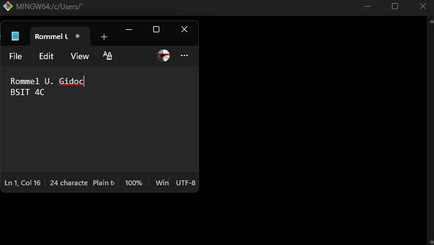
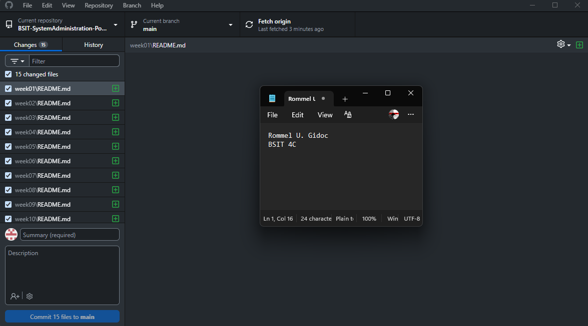
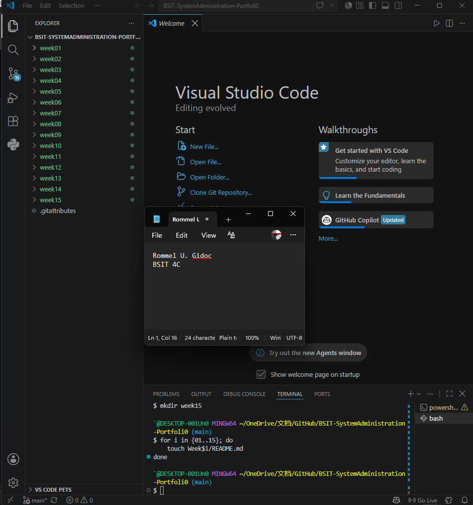

# Week 1 – Building My Professional Environment

## Student Information

* Name: Gidoc Jr. Rommel U.
* Course: BSIT
* Section: 4C
* Date: 08/08/26

# Objectives

1. To set up a professional computing environment for system administration tasks.
2. To install and configure essential software tools used by System Administrators.
3. To create and manage professional online accounts required for learning and collaboration.
4. To develop basic troubleshooting skills during software installation and configuration.
5. To understand the importance of maintaining a secure and organized working environment.

# Software Installed

| Software           | Purpose                                   |
| ------------------ | ----------------------------------------- |
| Visual Studio Code | Source code editing and scripting         |
| Git                | Version control and repository management |
| GitHub Desktop     | Graphical interface for Git operations    |
| VirtualBox         | Virtual machine management                |

# Professional Accounts

GitHub: https://github.com/echizennn
LinkedIn: https://www.linkedin.com/in/rommel-gidoc-jr-ba2540427/

# Installation Screenshots

## Git Installation

## GitHub Desktop Installation

## Visual Studio Code Installation

## VirtualBox Installation

# Challenges Encountered

### 1. Slow Download Speed

During the software installation process, some installers took a long time to download due to a slow internet connection. To solve this problem, I downloaded the files during off-peak hours and used stable network connectivity to prevent interruptions.

### 2. Installation Permission Error

While installing one of the applications, Windows displayed an administrator permission error. I resolved this issue by running the installer as an administrator and ensuring that my account had sufficient privileges.

### 3. Account Verification Issues

During account creation, verification emails were delayed and did not immediately appear in my inbox. I checked the spam folder, requested a new verification email, and successfully completed the account verification process.

# Reflection

Building my professional environment helped me understand the importance of preparing the right tools before performing system administration tasks. Installing software such as Visual Studio Code, Git, and VirtualBox introduced me to the essential applications commonly used by IT professionals. I also learned how to create and manage professional accounts that support collaboration, version control, and access to technical resources.

One of the most valuable lessons from this activity was troubleshooting installation and configuration problems. Encountering issues such as permission errors, slow downloads, and account verification delays taught me how to identify problems systematically and apply appropriate solutions. These experiences improved my confidence in handling technical challenges independently.

The tools installed during this activity will support my development as a future System Administrator by providing a platform for scripting, virtualization, system testing, and documentation. Git and GitHub will help me manage configurations and track changes, while VirtualBox will allow me to create virtual environments for testing and learning without affecting the host system. Overall, this activity established a strong foundation for future laboratory exercises and professional work in system administration.

# References

1. Visual Studio Code Documentation – https://code.visualstudio.com/docs
2. Git Documentation – https://git-scm.com/doc
3. GitHub Documentation – https://docs.github.com
4. Oracle VirtualBox Documentation – https://www.virtualbox.org/wiki/Documentation
5. Microsoft Learn – https://learn.microsoft.com
6. LinkedIn Help Center – https://www.linkedin.com/help
